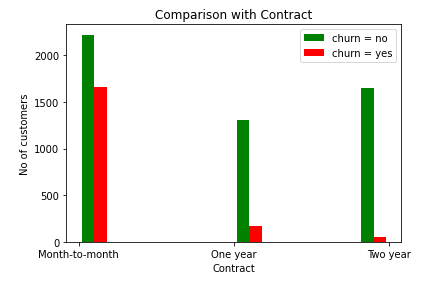
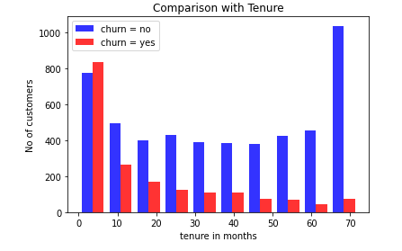
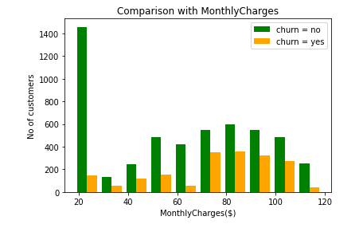
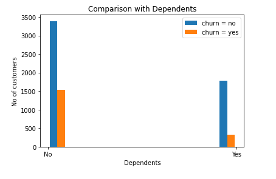

## About Dataset
* This is a Telco-Customer-Churn dataset, I took this csv file from kaggle. Each row represents a customer, each column contains customer’s attributes described on the column Metadata.

* The data set includes information about:

    * Customers who left within the last month – the column is called Churn

    * Services that each customer has signed up for – phone, multiple lines, internet, online security, online backup, device protection, tech support, and streaming TV and movies

    * Customer account information – how long they’ve been a customer(tenure), contract, payment method, paperless billing, monthly charges, and total charges

    * Demographic info about customers – gender, age range, and if they have partners and dependents. Dataset contains 7043 rows and 21 columns.

## Objective of this project

* **My goal is to predict the number of customers leaving the phone service**. We need to understand better the situation, which customers are likely to leave and why. Once it is clear what features are impacting customer churn, then we can start create Machine Learning Models.

## Exploratory Data Analysis(EDA)
### Data Visualization
    
   
