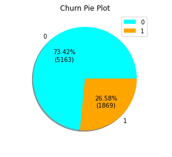
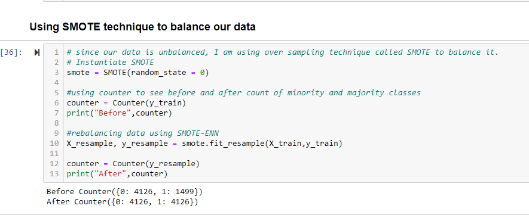
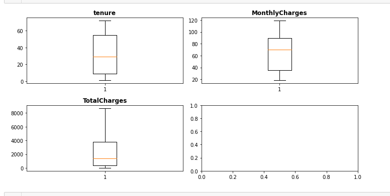
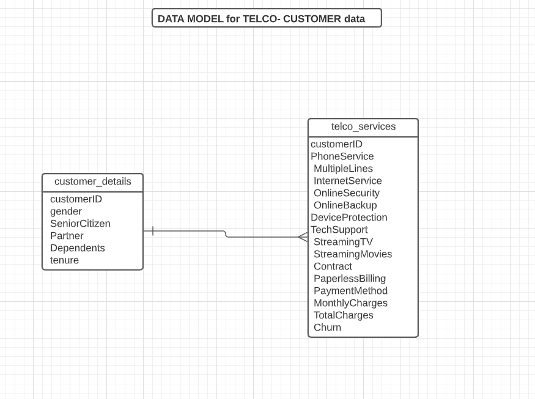

# Table Of Contents
1. About Dataset
2. Objective of this project
3. Exploratory Data Analysis(EDA)

      * 3a.Data Visualization
      * 3b.Preprocessing
      * 3c.Imbalanced Dataset
      * 3d.Correlation Heat Map
      * 3e.Checked for outliers
4. ETL
5. Model Selection
      * 5a. Logistic Regression
      * 5b. Support Vector Machines
      * 5c. RandomForestClassifier(Bagging technique)
      * 5d. XGBoost Classifier(Boosting technique)
6. Hyper parameter tuning
7. Result Interpretation
8. Is overfitted or Underfitted?
9. Conclusion

## 1.About Dataset
* This is a Telco-Customer-Churn dataset, I took this csv file from kaggle. Each row represents a customer, each column contains customer’s attributes described on the column Metadata.

* The data set includes information about:

    * Customers who left within the last month – the column is called Churn

    * Services that each customer has signed up for – phone, multiple lines, internet, online security, online backup, device protection, tech support, and streaming TV and movies

    * Customer account information – how long they’ve been a customer(tenure), contract, payment method, paperless billing, monthly charges, and total charges

    * Demographic info about customers – gender, age range, and if they have partners and dependents. Dataset contains 7043 rows and 21 columns.

## 2.Objective of this project

* **My goal is to predict the number of customers leaving the phone service**. We need to understand better the situation, which customers are likely to leave and why. Once it is clear what features are impacting customer churn, then we can start create Machine Learning Models.

## 3.Exploratory Data Analysis(EDA)
### 3a.Data Visualization
      

### 3b.Preprocessing
      * There are no null values in this dataset.
      * Encoded 18 categorical columns
      * Standardized 3 columns(tenure, MonthlyCharges, TotalCharges)
      * Checked for outliers

### 3c.It is an imbalanced Dataset

### 3d.Discussions from Correlation Heat Map
* The correlation goes from + 1 to - 1 where 1 is total positive linear correlation 0 is no linear correlation and negative 1 is total negative linear correlation.

* From color bar,

   * Yellows are negative correlations,

   * Darker the yellow, stronger negative correlation

   * Middle section where the colors are real light blue where there's not much correlation at all

   * the Dark blues are positive correlation and

   * the darker the blue the stronger positive correlation

   * Churn is highly correlated(positive correlation)with tenure,InternetService_Fiber optic, Contract_Month-to-month, Contract_Two year, PaymentMethod_Electronic check.

   * Churn is strongly correlated with itself.

### 3e.Checked for outliers

* Boxplot clearly shows that there are no outliers in the data.
## 4. ETL
   * Stored the data in a database and used ETL to get it there. Created a data model. 
    
   * ETL code is in Final_ETL jupyter notebook

## 5. Model Selection
   * I used PCA(Principal Component Analysis) Dimensionality reduction technique to give an efficient inputs to my models. I gave a brief explanation about the models I chose.
### 5a. Logistic Regression
   * Logistic regression is a statistical analysis method to predict a binary outcome, such as yes or no, based on prior observations of a data set.
Since it predicts probability, the output values lies between 0 and 1(probability always lies between 0 to 1)
          
### 5b. Support Vector Machines
   * Main Objective of Support Vector Machine is find a hyperplane for an N Dimensional features that classify the data points. Hyper planes are decision boundaries that help classify the data points. Datas which on or near to the boundary (hyper plane) are called support vectors. Hence the name become Support Vector Machines. Hyper plane which contains maximum distance between support vectors is the best hyperplane we can select.

   * SVM has a special property it uses only the support vectors and the rest of the data points can be removed without affecting fitting the model. All Other classifiers uses all data points while fitting the model.
     
### 5c. RandomForestClassifier(Bagging technique)
   * Random Forest is a bagging(bootstrap aggregating) technique. Base estimator is decision tree. RF combines various decision trees to produce more generalized model. We can reduce high variance using bagging. Independent estimators

   * Each tree will split based on different features.Since its a bagging technique, RF is a parallel process, meaning - doesn't wait for the previous process to be done.
     
### 5d. XGBoost Classifier(Boosting technique)
   * Its a boosting technique. These techniques are sequential - processes are executed one after another. Dependent estimators.
Boosting will attempts to correct the errors of previous model.

## 6. Hyper parameter tuning
   * A parameter being manually set by modeler is called hyper parameter. To obtain best model performance we need to tune hyper parameters.
Model's default hyperparameters are not optimal for all problems. Tuned hyperparameters for the model to get an improved results. 

## 7.Result Interpretation
   * Compared the results after hyper parameter tuning and chose the best model based on high performance metric. Since it is classification problem, I am taking ROC(Receiver Optimistic Curve) and AUC(Area Under Curve) score as my performance metrics. The higher the AUC, the better the performance of the model at distinguishing between the positive and negative classes.
## 8. Is overfitted or Underfitted?
   * I have checked my training and testing accuracy of logistic regression model.My model is not over or under fitted. Because
training and testing accuracies are almost same.
## 9.Conclusion
   * I have started by cleaning the telco customer churn data and analyzing it with visualization. Stored the data in a database and used ETL to get it there. Created a data model. Then, to be able to build a machine learning model,transformed the categorical data into numeric variables (feature engineering). After transforming the data, I tried 5 different machine learning algorithms using default parameters. And then, tuned the hyperparameters of those algorithms for model optimization, obtaining an AUC score of 86% from Logistic Regression Algorithm.
